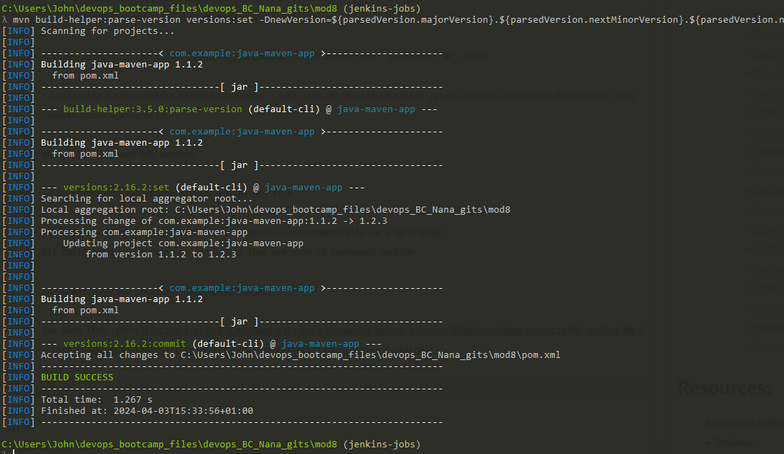

## Demo Project: 
### Configure Webhook to trigger CI Pipeline automatically on every change

#### Technologies used:
- Jenkins, GitLab, Git, Docker, Java, Maven

#### Project Description:
1. Install GitLab Plugin in Jenkins
2. Configure GitLab access token and connection to Jenkins in GitLab project settings
3. Configure Jenkins to trigger the CI pipeline, whenever a change is pushed to GitLab

*Gitlab account used only for this reason*
*Will add github & bitbucket connection in personal projects*

- Go to Jenkins Plugins, search for Gitlab plugin & install

- head to System, scroll down to Gitlab
    - name: gitlab-connection
    - host url: https://gitlab.com/
    - credentials:
        - Click Add > Jenkins
        - Change kind to "Gitlab API Token"
        - Go to users Pref on Gitlab > click Access tokens
            - Click Add new token
                - Give it a name "Jenkins"
                - can give it an expiration date
                - then select the scope: api
                - Click "Create personal access token"
                - Take a copy of the access toekn - you wont be able to see this again
        - Head back to Jenkins, and paste the access token into the API token field
        - ID: call it "gitlab-token"
        - Click add
    - From the drop down menu now, you can select gitlab-token
    - click test connection, make sure its a success
    - Click save

- Interestingly, if you head to a pipeline jobs configuration, you can see the gitlab-connection we just created
- Scrolling down further you can see other new options, like:
    - Build when a change is pushed to GitLab. GitLab webhook URL: http://164.92.163.54:8080/project/my-pipeline

- The next part is to setup Gitlab to automatically send notifiers to Jenkins whenever a commit / push happens

- Head to settings inside the project (bottom left) > click "integrations"
    - Scroll down to Jenkins, press configure
    - keep it enabled
    - Trigger:
        - select what the trigger will be, in this case a push
    - pop in the url: http://164.92.163.54:8080 (my Jenkisn server)
    - untick SSL
    - Project Name: is the job name that will trigger the build!
        - my-pipeline
    - Username & password: your creds you use to login to the user a/c on the server
- Save the changes

- You can test this connection, by clicking "Test settings"

you will get: the below in the bottom left corner:

- after some reconfiguration of Jenkinsfile finally got the pipeline working with the trigger

- changed a line in feature/payment to trigger a rebuild, the below image shows the build during 

## Configure automatic triggering of Jenkins job for Multi-branch Pipeline

- The configuration change for MB pipelines used to be configurable the same way for a regular pipeline, this is however not the case anymore!
    - **BUT** we need another plugin!
    - Install: 

    - Nothing needs to be done in the system

- open the "my-multibranch-pipeline" > configure
- Under "Scan Multibranch Pipeline Triggers", there are 2options:
    - Periodically if not otherwise run
        - can choose an interval: 1 min to 4 weeks
    - Scan for webhook (this is the one we want, because we need it to run on a push / pull etc)
        - Looking for a trigger token, call it "github-token"
        - This is used for the comms between Jenkins & the git repo
- Click save! as this will trigger Jenkins to scan again (after any config changes)

- Head back to gitlab, from the project, click Settings > Webhooks
    - URL: http://164.92.163.54:8080/multibranch-webhook-trigger/invoke?token=gitlabtoken
        - this is the url Jenkins is accepting calls from the repo
    - Secret token: isn't use in this case
    - Trigger: Push Events
        - It then asks whether it should be:
            - All branches
            - Wildcard Pattern
            - Regex
    - Press Add Webhook
        - You can also run tests (from a drop down)

