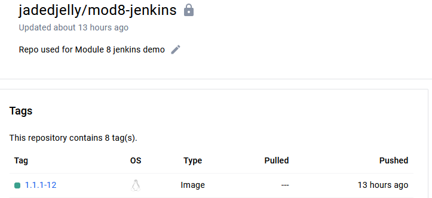

## Demo Project: 
### Create a CI Pipeline with Jenkinsfile (Freestyle, Pipeline, Multibranch Pipeline)

#### Technologies used:
- Jenkins, Docker, Linux, Git, Java, Maven

#### Project Description:
CI Pipeline for a Java Maven application to build and push to the repository
1. Install Build Tools (Maven, Node) in Jenkins
2. Make Docker available on Jenkins server
3. Create Jenkins credentials for a git repository
4. Create different Jenkins job types (Freestyle, Pipeline, Multibranch
pipeline) for the Java Maven project with Jenkinsfile to:
    - Connect to the application’s git repository
    - Build Jar
    - Build Docker Image
    - Push to private DockerHub repository
-----------------------------------------------------------------------------------------

## Configure a Plugin for Maven
From the UI
- From Jenkins Dashboard, head to:
    - Manage Jenkins > Tools
        - In here multiple configurations are available - Gradle, Ant, Git, Maven (here but not configured, so can't be used in jobs)
    - Click Add Maven
    - Give it a name (like maven-3.9)
    - Select the version you want


    - Click save & this will dowload and make available

*Note: You also have the option to add an installer via extract of a tar, run sh / bat command (server os pending) etc*

## Install npm and Node in Jenkins Container
From the command line (server / container)
- ssh to server
- Once here if you run the docker exec command as below, it will log you in as the Jenkins user (1), we need to log in as root (2):
```bash
# (1)
docker exec -it 8e1c bash
# (2) -u = username, 0 denotes root (uid)
docker exec -u 0 8e1c bash


a handy command to remember is the below, this cats the version you are running in a container
```bash
cat etc/issue
```
In this case its: "*Ubuntu 22.04.4 LTS \n \l*"

as is best practice before installing s/w, we run the below:
```bash
apt update && apt install curl -Y
```
we run nthe below, which downloads a node installer script, runs it, then installs it:
```bash
curl -sL https://deb.nodesource.com/setup_20.x -o nodesource_setup.sh && bash nodesource_setup.sh && apt install nodejs -Y
```
we can then run the node & npm with the -v flag


## Jenkins Basics Demo - Freestyle job

- From the Dashboard:
    - Click either New item (left) or Create job (centre screen)
    - Give it a name "my-job"
    - and select "Freestyle project"
    - click ok
- In the next screen, this is where you can add your SCM, Triggers, Environment & build steps
    - Keep everything as default, and scroll to "Build Steps"
    - click the drop down menu here, and the below is displayed


    - select "execute shell"
        - these are execute inside the Jenkins container
    - pop in "npm --version"
    - we can't run mvn as it's not installed directly in the container (recall it's a plugin)
    - click the drop down again, and select "Invoke top-level maven targets"
    - in the next drop down, select the maven we have configured (maven-3.9) and set the "goal" as --version
as below:


    - click save
    - heading back to the dashboard, we can see the list of jobs
click it we are brought into the job itself:


click "Build now" to run the job
    - click "Console Output" and we see the output
    


**Remember**: /var/jenkins_home is the volume we created and mounted for this container

## Install a plugin via the plugins option in "manage jenkins"

From Dashboard, head to Manage Jenkins > then Plugins
- Click available plugins
- search NodeJs
- tick the box and then click install (top right)


- then going back to Tools, we can see a configuration for NodeJS, as below:


- Heading back to my-job > Configure > scroll down to "Build steps", we can see from teh drop down menu we now have an option for "Execute NodeJS script" as below:



## Configure Git Repository

[Starter code](https://github.com/jadedjelly/M8-Jenkins-demos/tree/starter-code)

 From inside the job (via configure), head to Source code management
    - Input the git url
    - Credentials:
    - If you dont have credentials saved, you can click add and Jenkins will go through the setup, via the below:


- From kind you have multiple options you can use:


- We keep everything as default, and add the following:
        - Username, Password, Description (we can ref later)
    - next we can specify what branch we want to build, starter-code is the name of teh branch so we change it here
    - click save & Build now, the output is below:


- In the outpt we can see:
        - Jenkins cloned my repo (saved to var/jenkins_home/workspaces/my-job - will get into this later)
        - ran the npm --version
        - ran the mvn --version
- if we access the container (exec command), and ls to /var/jenkins_home we can see files that contain info on plugins, credentails, jobs, logs, etc


- Inside the jobs folder, will list all jobs created on the server, including their builds (every time you build the job it creates a new build) and an xml file that shows all the options used
- If we look inside the workspaces folder and into the my-job folder we can see the cloned repo, in the my-job@tmp is a temporary folder 

## Complete task from git repo in Jenkins job

- head back to job configuration, change the branch specifier to */jenkins-jobs and go to Build steps and remove the npm --version command and add chmod +x on the script and add the script name to be executed
- The reasoning behind the chmod is to give jenkins permissions to execute it, as below:


- click save and then "build now", output below: 


## Run test & build Java Application


- we create a new freestyle job, call it "java-maven-build"
- add the repo:
    - https://github.com/jadedjelly/M8-Jenkins-demos.git
- change the credentials to the ones we created earlier
- change the branch to "jenkins-jobs"
- Add a build step "Invoke top-level maven targets"
- choose the version we created earlier (maven-3.9)
- add "test" in to goals
- do the same again put add "package" as the goal
- click save
- Looking through the output (very long), we see that the app has been tested & packaged, and now when we go to the server and do a ls of /var/jenkins_home/workspace/java-maven-build/target we can see the jar files as below:


## Make Docker available on Jenkins server
We need to mount the Docker runtime directory to the container, 1st we need to stop the container
- ssh ont othe jenkins server, and run the below stop command:
```bash
docker container stop
```
then run the below to add the docker.sock folder (runtime)
```bash
docker run -p 8080:8080 -p 50000:50000 -d -v jenkins_home:/var/jenkins_home -v /var/run/docker.sock:/var/run/docker.sock jenkins/jenkins:lts
```
then we need to grab the latest version, change the permissions on it then run it (docker exec -u 0 etc)

```bash
curl https://get.docker.com/ > dockerinstall && chmod 777 dockerinstall && ./dockerinstall
```

- then we need to give the jenkins user permissions to use docker commands, so we remote into the container and run:
```bash
chmod 666 /var/run/docker.sock
```


we can now run docker commands from inside the "execute shell" area of a job configuration

## Build Docker image 


```Dockerfile
FROM amazoncorretto:8-alpine3.17-jre

EXPOSE 8080

COPY ./target/java-maven-app-*.jar /usr/app/
WORKDIR /usr/app

CMD java -jar java-maven-app-*.jar
```
The above has been added as a Dockerfile to the jenkins-jobs branch of the java-maven app

- From the dashboard, click java-maven-build > then configuration
- scroll down to "build steps", remove the maven command to test, as the package command does this
- Add a new build step for "Execute shell"
- add the following to the shell:
    -  docker build .
    -  we also add the name tag -t along with java-maven-app
```bash
docker build -t java-maven-app:1.0 .
```
- click save & Build now
Now when we look at docker images on the server we can see our java-maven app image as listed:


## Push image to Docker hub
As a next step we will push that image to a Docker Repo


- Create a private repo on Dockerhub account, give it a name and set it to private


- Then from Jenkins dashboard, go to Manage Jenkins > from the Security section, select Credentials > select "Global Credentials (unrestricted)" > You'll see the github -creds created earlier listed
- Press "add Credentials"
    - add username, password & give an id of "Docker-hub-repo"
- Press Create
- Go back to the "java-maven-build" job, press "configure"
- Scroll to "execute shell", the way we push to a private repo, is to add it to the tag element as below: 
```bash
docker build -t jadedjelly/mod8jenkins:1.0 .
docker push jadedjelly/mod8jenkins:1.0
```
- Obviously we need to login so Jenkins can use those credentials we just created so between the build and push we add docker login. If we're doing this from the temrinal we are prompted, we can't do that here so we need to enable another plugin (noted under "build Environment", "Use secret text(s) or files(s)", from the drop down box (as "Bindings"), as below:


- and select > "Username & Password (seperated)"
- Give the username & password variable names
- From the drop down box, select the docker hub one
NOTE: *When creating credentials, add a description to the creds as it appears in the drop down box as only [username]/[password] with no designation between the 2x when not done!!!*


```bash
docker build -t jadedjelly/mod8jenkins:1.0 .
docker login -u $USERNAME -p $PASSWORD
docker push jadedjelly/mod8jenkins:1.0
```


- pushing to an external repo like ecr / nexus etc you would amend the tag with the externals url as below:
```bash
docker push aws_account_id.dkr.ecr.us-west-2.amazonaws.com/my-repository:tag
```
- click save and Build now


Note: *Within the output we get a warning that the password via cli is insecure and should use --password-sdtin, the fix is below*

- CHnaging the line for authentication we pipe the password variable into the docker login

```bash
docker build -t jadedjelly/mod8jenkins:jma-1.0 .
echo $PASSWORD | docker login -u $USERNAME --password-stdin
docker push jadedjelly/mod8jenkins:jma-1.0
```

- On test we get a success message

## Push docker image to Nexus repo
NOTE: *had to rebuild nexus server, this time as a docker image... *
http://157.230.30.94:8081/repository/docker-hosted/
- From the root of the jenkins server, we create a new file called daemon.json in /etc/docker/, with the below:
```json
}
  "insecure-registries": ["157.230.30.94:8083"]
}
```
- Recall [ip of Docker repo]:[port number be assigned for http]
NOTE: *daemon.json = config file used by docker to specify settings to customize  the behaviour*
NOTE2: *we add this to the host, we only mounted docker to jenkins!*
- Now we restart docker so changes can be made
    - systemctl restart docker
    - also need to restart the container
- We head back to Jenkins, and configure the "java-maven-build" to push to our Nexus repo
- 1st we need to setup credentials so Jenkins can push to Nexus
- From credentials we add one for Nexus


- Head to the configuration for the java-maven-build, replace the dockerhub credentials with that of the newly created Nexus creds
- From execute shell we need to ammend it for pushing to NExus
```bash
docker build -t 157.230.30.94:8083/java-maven-app:1.1 .
echo $PASSWORD | docker login -u $USERNAME --password-stdin 157.230.30.94:8083
docker push 157.230.30.94:8083/java-maven-app:1.1
```
- save & Build now


