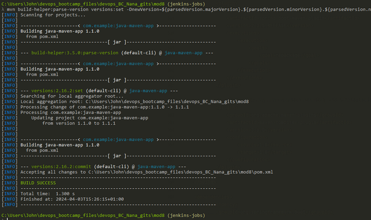

## Creating a Multibranch Pipeline

- Head to the Jenkins Dashboard, select new item, name it "my-multibranch-pipeline" and select Multibranch pipeline
- scroll to "branch sources" and git source from the drop down
- Paste in the git repo address (https://github.com/jadedjelly/M8-Jenkins-demos.git)
- Use the Gitcreds we created earlier
- Then from Behaviours, click the Add drop down and select "Filter by name with regular expressions"
    - So here you can add "java Regular Expression" [Offical documentation here](https://docs.oracle.com/javase/7/docs/api/java/util/regex/Pattern.html)
    - Nana wants to add all of them and dynamically discover them, whenever a new one is added
- This regular expression will match everything we want

```bash
.*
```

- we are building all the branches from Jenkins_module8 repo
- Everything else is defined in the Jenkinsfile
- click save
- as soon as you press save, a scan executes, the output as of writing is as below:

```bash
Started by user johnk
[Tue Apr 02 11:50:10 UTC 2024] Starting branch indexing...
 > git --version # timeout=10
 > git --version # 'git version 2.39.2'
using GIT_ASKPASS to set credentials guthub-creds
 > git ls-remote --symref -- https://github.com/jadedjelly/Jenkins_Module8.git # timeout=10
 > git rev-parse --resolve-git-dir /var/jenkins_home/caches/git-ced90ed8bd17c96b90848363faf0f943/.git # timeout=10
Setting origin to https://github.com/jadedjelly/Jenkins_Module8.git
 > git config remote.origin.url https://github.com/jadedjelly/Jenkins_Module8.git # timeout=10
Fetching & pruning origin...
Listing remote references...
 > git config --get remote.origin.url # timeout=10
 > git --version # timeout=10
 > git --version # 'git version 2.39.2'
using GIT_ASKPASS to set credentials guthub-creds
 > git ls-remote -h -- https://github.com/jadedjelly/Jenkins_Module8.git # timeout=10
Fetching upstream changes from origin
 > git config --get remote.origin.url # timeout=10
using GIT_ASKPASS to set credentials guthub-creds
 > git fetch --tags --force --progress --prune -- origin +refs/heads/*:refs/remotes/origin/* # timeout=10
Checking branches...
  Checking branch jenkins-jobs
      ‘Jenkinsfile’ not found
    Does not meet criteria
  Checking branch main
      ‘Jenkinsfile’ found
    Met criteria
Scheduled build for branch: main
Processed 2 branches
[Tue Apr 02 11:50:11 UTC 2024] Finished branch indexing. Indexing took 1.3 sec
Finished: SUCCESS

```

- if we head to the Dashboard, we can see the newly created multibranch pipeline nad clicking into it we can see the branches that have been scanned

*NOTE: to see this in more action, suggest you run the repo from Jenkins 2: Up & Running*

Nana notes you could have multiple branches defined in a regular pipeline, but this will not have the same transparency, it also wont have the same access to the tools 

- Generally, there's a single Jenkinsfile that all branches share.
    - So within that file we would build on master only and test for all others
- Demo Below

## Branch-based logic for Multibranch Pipeline

- So we want test to run on all the branches, so our build & deploy stages will have something similar to an IF statement
    - in groovy, we use "when"
    - **REMEMBER** the ENV_Variables listed for Jenkins ([here](https://www.jenkins.io/doc/book/pipeline/jenkinsfile/#using-environment-variables))

```groovy
pipeline {
    agent none
    stages {
        stage('test') {
            steps {
                script {
                    echo "Testing the application..."
                    echo "Executing pipeline for branch $BRANCH_NAME"
                }
            }
        }
        stage('build') {
            when {
                expression {
                    BRANCH_NAME == 'master'
                }
            }
            steps {
                script {
                    echo "Building the application..."
                }
            }
        }
        stage('deploy') {
            when {
                expression {
                    BRANCH_NAME == 'master'
                }
            }
            steps {
                script {
                    echo "Deploying the application..."
                }
            }
        }
    }
}

```

- We head back to our jenkins, and click "Scan Multibranch pipeline now"

From the main window, we can see that both branches are visible & both have been built:


Looking at the logs, we can see the output, and seeing as it wasn't a master branch build and deploy were ignored
(Jenkins-jobs branch)



(main branch)


- Above you can see the difference between the build steps taken between main and Jenkins-jobs
- we create a new branch based on main, and run the scan again
- new feature branch appears


and the job logs, show as expected


