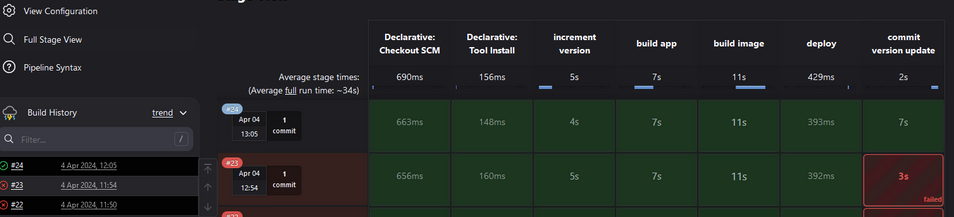
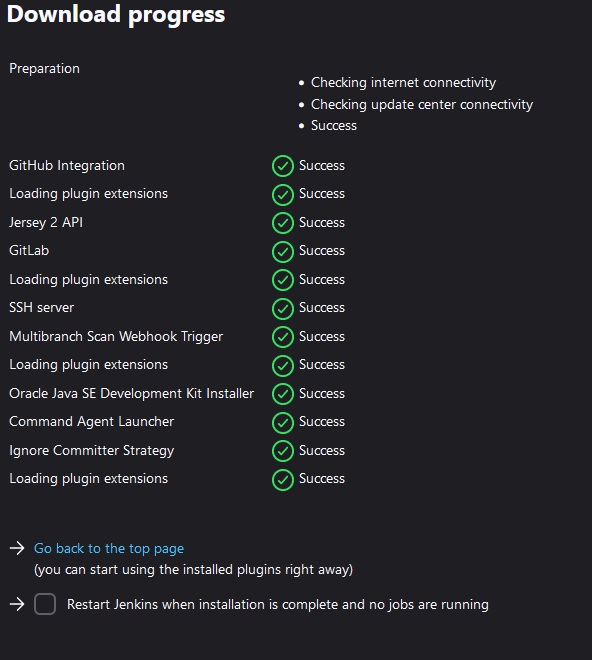

## Demo Project: 
### Create a CI Pipeline with Jenkinsfile (Freestyle, Pipeline, Multibranch Pipeline)

#### Technologies used:
- Jenkins, Docker, Linux, Git, Java, Maven

#### Project Description:
CI Pipeline for a Java Maven application to build and push to the repository
1. Install Build Tools (Maven, Node) in Jenkins
2. Make Docker available on Jenkins server
3. Create Jenkins credentials for a git repository
4. Create different Jenkins job types (Freestyle, Pipeline, Multibranch
pipeline) for the Java Maven project with Jenkinsfile to:
    - Connect to the application’s git repository
    - Build Jar
    - Build Docker Image
    - Push to private DockerHub repository
-----------------------------------------------------------------------------------------

## Configure a Plugin for Maven
From the UI
- From Jenkins Dashboard, head to:
    - Manage Jenkins > Tools
        - In here multiple configurations are available - Gradle, Ant, Git, Maven (here but not configured, so can't be used in jobs)
    - Click Add Maven
    - Give it a name (like maven-3.9)
    - Select the version you want


    - Click save & this will dowload and make available

*Note: You also have the option to add an installer via extract of a tar, run sh / bat command (server os pending) etc*

## Install npm and Node in Jenkins Container
From the command line (server / container)
- ssh to server
- Once here if you run the docker exec command as below, it will log you in as the Jenkins user (1), we need to log in as root (2):
```bash
# (1)
docker exec -it 8e1c bash
# (2) -u = username, 0 denotes root (uid)
docker exec -u 0 8e1c bash


a handy command to remember is the below, this cats the version you are running in a container
```bash
cat etc/issue
```
In this case its: "*Ubuntu 22.04.4 LTS \n \l*"

as is best practice before installing s/w, we run the below:
```bash
apt update && apt install curl -Y
```
we run nthe below, which downloads a node installer script, runs it, then installs it:
```bash
curl -sL https://deb.nodesource.com/setup_20.x -o nodesource_setup.sh && bash nodesource_setup.sh && apt install nodejs -Y
```
we can then run the node & npm with the -v flag


## Jenkins Basics Demo - Freestyle job

- From the Dashboard:
    - Click either New item (left) or Create job (centre screen)
    - Give it a name "my-job"
    - and select "Freestyle project"
    - click ok
- In the next screen, this is where you can add your SCM, Triggers, Environment & build steps
    - Keep everything as default, and scroll to "Build Steps"
    - click the drop down menu here, and the below is displayed


    - select "execute shell"
        - these are execute inside the Jenkins container
    - pop in "npm --version"
    - we can't run mvn as it's not installed directly in the container (recall it's a plugin)
    - click the drop down again, and select "Invoke top-level maven targets"
    - in the next drop down, select the maven we have configured (maven-3.9) and set the "goal" as --version
as below:


    - click save
    - heading back to the dashboard, we can see the list of jobs
click it we are brought into the job itself:


click "Build now" to run the job
    - click "Console Output" and we see the output
    


**Remember**: /var/jenkins_home is the volume we created and mounted for this container

## Install a plugin via the plugins option in "manage jenkins"

From Dashboard, head to Manage Jenkins > then Plugins
- Click available plugins
- search NodeJs
- tick the box and then click install (top right)


- then going back to Tools, we can see a configuration for NodeJS, as below:


- Heading back to my-job > Configure > scroll down to "Build steps", we can see from teh drop down menu we now have an option for "Execute NodeJS script" as below:


## Configure Git Repository

[Starter code](https://github.com/jadedjelly/M8-Jenkins-demos/tree/starter-code)

 From inside the job (via configure), head to Source code management
    - Input the git url
    - Credentials:
    - If you dont have credentials saved, you can click add and Jenkins will go through the setup, via the below:



- From kind you have multiple options you can use:


- We keep everything as default, and add the following:
        - Username, Password, Description (we can ref later)
    - next we can specify what branch we want to build, starter-code is the name of teh branch so we change it here
    - click save & Build now, the output is below:



- In the outpt we can see:
        - Jenkins cloned my repo (saved to var/jenkins_home/workspaces/my-job - will get into this later)
        - ran the npm --version
        - ran the mvn --version
- if we access the container (exec command), and ls to /var/jenkins_home we can see files that contain info on plugins, credentails, jobs, logs, etc


- Inside the jobs folder, will list all jobs created on the server, including their builds (every time you build the job it creates a new build) and an xml file that shows all the options used
- If we look inside the workspaces folder and into the my-job folder we can see the cloned repo, in the my-job@tmp is a temporary folder 

## Complete task from git repo in Jenkins job

- head back to job configuration, change the branch specifier to */jenkins-jobs and go to Build steps and remove the npm --version command and add chmod +x on the script and add the script name to be executed
- The reasoning behind the chmod is to give jenkins permissions to execute it, as below:


