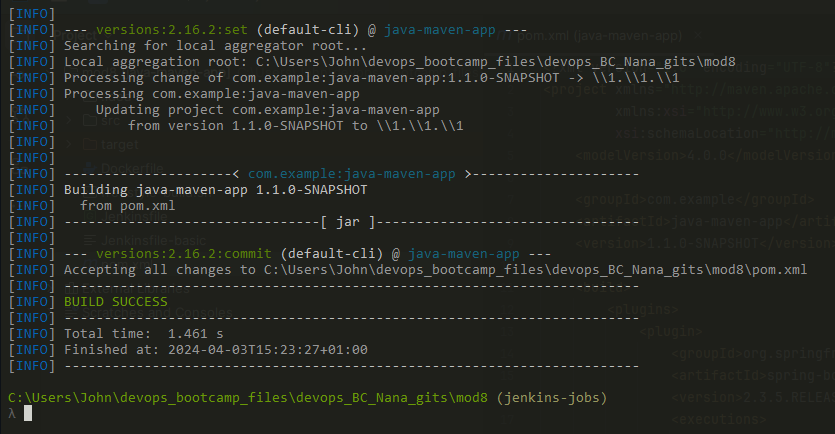

## Demo Project: 
### Install Jenkins on DigitalOcean

#### Technologies used:
- Jenkins, Docker, DigitalOcean, Linux

#### Project Description:
1. Create an Ubuntu server on DigitalOcean
2. Set up and run Jenkins as Docker container
3. Initialize Jenkins

2x options, either directly on the server (requiring java, a new user, etc) or (hopefully in this instance) on a container, where everything is done

- we create a new droplet (region (FK seems cheaper than london), Ubuntu, reg SSD @ 24/mo, use the normal ssh key, host renamed to jenkinsServer)
- create a new firewall, with the below ports:
    - 22 - set to my IP
    - 8080 - for jenkins

- ssh in, and run: (note: look up how to use default options for menu prompts....)
```bash
apt update -y && apt upgrade -y
```
then install docker with:
```bash
apt  install docker.io -y
```
we need to open the port for jenkins, so we'll set that up along with the usual
```bash
# [host:container]
# 8080:8080 how Jenkins communicates, but you also need 50000 open as well (I didn't see this last time I ran a 
# J.server, but its needed for the master and slave / worker) we also need to mount a vol (obvs), we dont want 
# to have to recreate everything if the container goes down

docker run -p 8080:8080 -p 50000:50000 -d -v jenkins_home:/var/jenkins_home jenkins/jenkins:lts
```
[docker hub jenkins](https://hub.docker.com/r/jenkins/jenkins)



Obvs when you start Jenkins for the 1st time, you get the setup wizard as below, and you'll need to get the temp admin creds for it here - /var/jenkins_home/secrets/initialAdminPassword

using the below we shell into the jenkins server to get to the temp password location


we could have also looked for the location for the volume using docker inspect volume [vol name]

- pw set to usual test pw
- click install suggested plugins


- now we create the 1st admin user
- start & finish, next on the url stuff and press "Start using Jenkins"

and Done!
